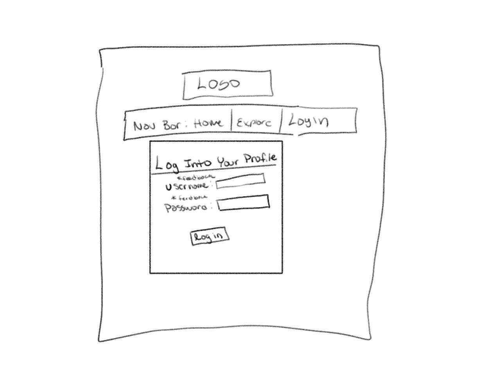
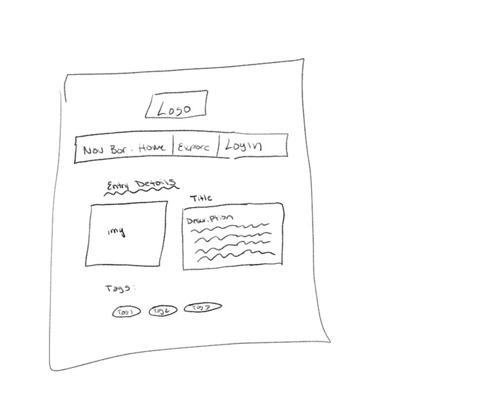
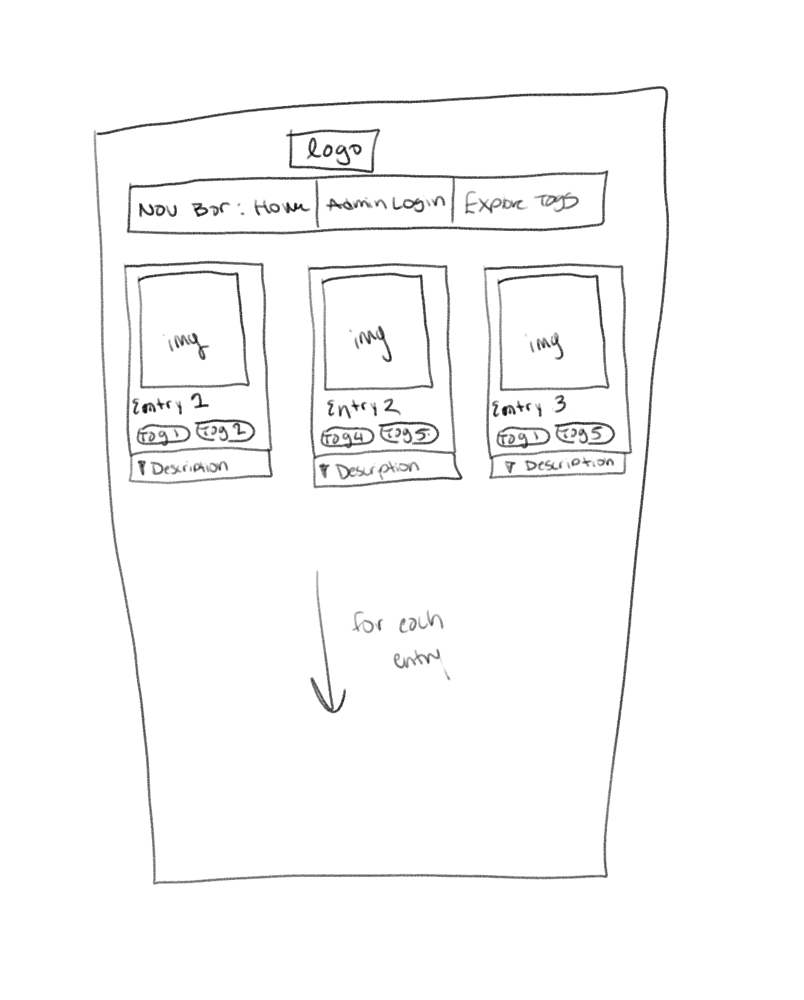
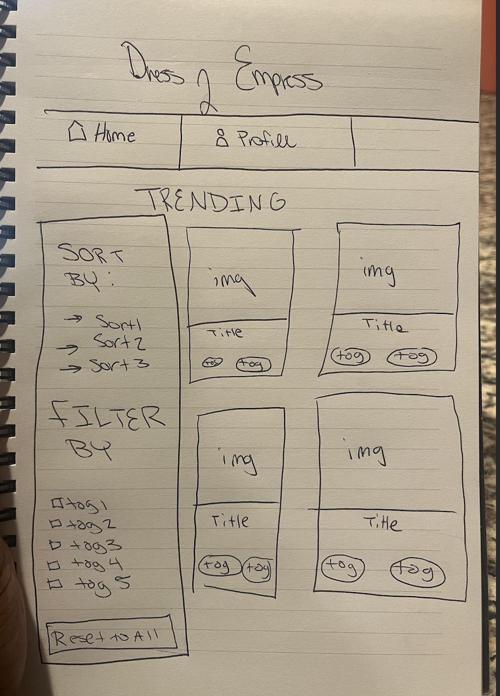
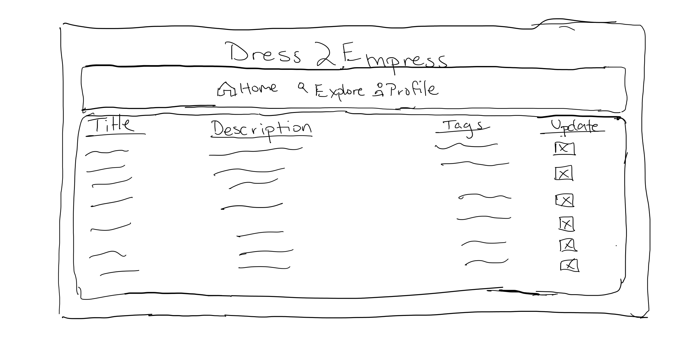
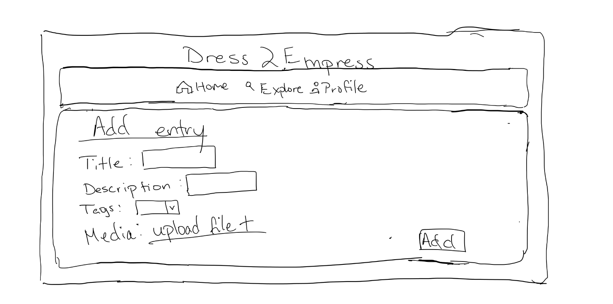

# Project 3, Milestone 1: **Team** Design Journey

[← Table of Contents](design-journey.md)

**Make the case for your decisions using concepts from class, as well as other design principles, theories, examples, and cases from outside of class (includes the design prerequisite for this course).**

You can use bullet points and lists, or full paragraphs, or a combo, whichever is appropriate. The writing should be solid draft quality.

## Catalog
> What will your catalog website be about? (1 sentence)

Our website will be a fashion lookbook catalog similar to Pinterest.

## Narrow or Wide Screen
> How will your **consumer** user access this website? From a narrow or wide screen?

Wide Screen.

## Catalog Design
> Sketch each page of your entire media catalog website
> Provide a brief explanation _underneath_ each sketch. (1 sentence per sketch)
> **Refer to consumer or administrator persona by name in each explanation.**

Natalie can use the login page where the user submits a form for her username and password

Jodie can access the details page where the information from the posts and tags tables are displayed for the entry she has interest in.

Jodie can view all the entries in this page in a card like format. The title, desciption, and tags can be accessed by her.

* added that she can also sort and filter the cards based on her preferences

Natalie can view all entries on this page in a table format and make easy edits by presing the edit thumbnail for eahc entry.

Natalie can add entries and upload media for the new entries here with this form.
## Catalog Design Patterns
> Explain how your design employs common catalog design patterns. (1-2 sentences)

Our design employs common catalog design patterns by effectively utilizing whitespace to separate different items in our catalog. Also our catalog uses a card design to present items to consumers to present the information in a visually appealing format.

## URL Design
> Plan your HTTP routing.
> List each route and the PHP file for each route.

| Page                                     | Route       | PHP File       |
| ---------------------------------------- | ----------- | -------------- |
| home / consumer view all / filter by tag | /           | pages/home.php |
| consumer entry details                   | /view  | pages/view.php|
| admin view all / filter by tag           | /profile    | pages/profile.php |
| admin insert entry                       | /profile/insert | pages/insert.php|
| admin edit entry / tag / untag           | /profile/edit | pages/edit.php |
| login                                    | /login      | pages/login.php |

> Explain why these routes (URLs) are usable for your persona. (1 sentence)

These routes are usable for the specified persona because they are intuitive and follow a logical structure. For example, "/profile" is where the admin can view all entries, while "/profile/edit" is where they can edit entries, ensuring ease of navigation and clarity of purpose for the user persona.

## Database Schema
> Plan the structure of your database. You may use words or a picture.
> A bulleted list is probably the simplest way to do this.
> Include constraints for each field.

**Table:** posts

- id: INT {primary key, auto-increment, not null, unique}
- title: TEXT {not null}
- description: TEXT {not null}

**Table:** tags

- id: INT {primary key, auto-increment, not null, unique}
- tag_name: TEXT {not null}

**Table:** post_Tags

- id: INT {primary key, auto-increment, not null, unique}
- post_id: INT {foreign key, not null}
- tag_id: INT {foregin key, not null}

## Contributors

I affirm that I have contributed to the team requirements for this milestone.

Consumer Lead: Stephanie Dyer

Admin Lead: Andre Thomas

[← Table of Contents](design-journey.md)
